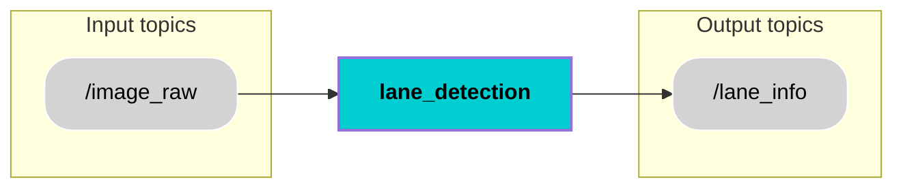

## 📚 Contents
- [Description](#-description)
- [Architecture](#-architecture)
- [Interfaces](#-interfaces)
- [Installation](#-installation)
- [Usage](#-usage)
- [Contributor](#-contributor)
- [License](#-license)

## 🧠 Description
The Lane Detection component is a vital part of the autonomous shuttle system's perception stack. It is responsible for analyzing real-time visual data from the shuttle's front-facing RealSense Camera to detect and interpret road lane boundaries. By processing raw image data from the `/image_raw` topic, the component identifies lane-related features using computer vision and/or deep learning methods. The extracted lane information is then formatted into a structured message and published to the `/lane_info` topic, where it becomes accessible to downstream modules such as the Environment Model. This data enables accurate path planning, guidance, and real-time lane-keeping, ultimately supporting safe and reliable vehicle operation.
## 🧩 Architecture

## 🔌 Interfaces
### Topics:
| Name                         | IO      | Type                 | Description                                                              |
|------------------------------|---------|----------------------|--------------------------------------------------------------------------|
| `/image_raw `  | Input   | `sensor_msgs/msg/Image.msg  `      |  Raw image stream from the front-facing RealSense camera              |
| `/lane_info`              | Output   | ` lane_msgs/msg/LaneInfo.msg`      |  Provides lane meta data  |      |
### Custom messages:
#### Message: `LaneInfo.msg`
| Name                          | Type                 | Description                                                              |
|------------------------------|----------------------|--------------------------------------------------------------------------|
| `left_lane`         | `geometry_msgs/msg/Polygon.msg`    | Polygon describing the detected left lane boundary                              |
| `right_lane`        | `geometry_msgs/msg/Polygon.msg`    | Polygon describing the detected right lane boundary                           |
| `center_line`       | `geometry_msgs/msg/Polygon.msg`    | Polygon describing the estimated lane center line     |
| `lane_width`        | `float32`                  | Width of the lane in meters.                                                  |
| `lane_type`         | `string`                   | Type of lane marking (e.g., "solid", "dashed", "segmented").                  |
| `lane_confidence`   | `float32`                  | Confidence score between 0.0 (low) and 1.0 (high).                            |
| `lane_angle`        | `float32`                  | Average angle of lane lines in degrees.                                       |
| `curvature_radius`  | `float32`                  | Radius of curvature of the lane in meters.                                    |
| `stamp`             | `builtin_interfaces/Time`  | Timestamp when the lane information was generated.                            |
### Interface test process:
Process for testing the above interfaces can be found [here](https://git.hs-coburg.de/pax_auto/lane_detection/src/branch/main/interface_test.md).
 

## 🛠️ Installation
1. Create workspace, src and go to src
```bash
mkdir lane_ws
cd lane_ws
mkdir src
cd src
```
2. Clone repository
```bash
git clone (https://github.com/DevadasVijayansheel/ros2_lane_detection.git)
```
3. Return to workspace and build the package/packages
```bash
cd ..
colcon build
```
4. Source the setup files
```bash
source install/setup.bash
```

## ▶️ Usage
Run the node:
```bash
ros2 run lane_detection_all detection_node
```

## 🧑‍💻 Contributor
[Devadas Vijayan Sheela](https://github.com/DevadasVijayansheel/ros2_lane_detection.git)

## 🔒 License
Licensed under the **Apache 2.0 License**. See [LICENSE](LICENSE) for details.
